# 깃 크라켄으로 안모각코 출석체크하는 방법

#### Git이 없으면 먼저 설치하셔야 합니다!
[Git 설치 링크](https://git-scm.com/downloads)로 이동해서 설치해주세요.


## GitKraken
[GitKraken student-developer-pack](https://www.gitkraken.com/github-student-developer-pack)을 다운 받아서 실행시킵니다.

**Sign in with Github**를 클릭해서 깃허브 계정으로 로그인 합니다.

## Fork 하기
AMGC repository 에서 우측 상단에 있는 **Fork** 버튼을 클릭합니다.

참여하고 있는 organization 이 여러 개인 경우, 자신의 계정을 선택해주세요.

Fork를 하면 사진처럼 이렇게 AMGC repository 가 당신의 계정으로 복사됩니다.


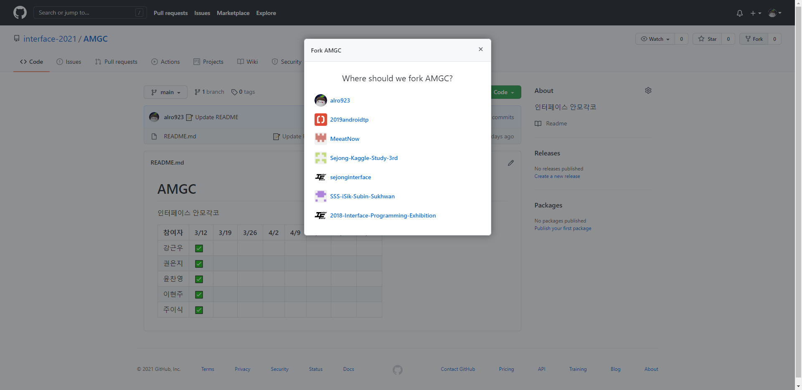

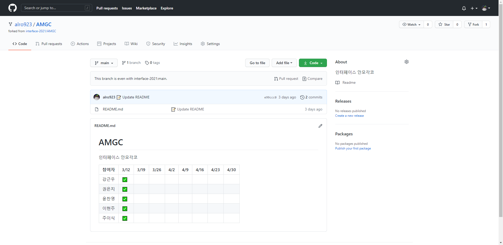

## Clone 하기
GitKraken 을 실행하고, **Clone a repo** 를 클릭합니다. (**File** → **Clone Repo** )

Repository Management 에서 **Clone GitHub.com** 을 클릭합니다.
- Where to clone to 에서는 repo를 clone해서 저장할 위치를 선택합니다. 자신이 원하는 위치로 설정해주면 됩니다.
- Repository to clone 에서는 clone 할 repository 를 선택합니다. 우리는 AMGC repository 를 선택해주면 됩니다.
- **Clone the repo!** 를 클릭합니다.

상단에 **Successfully cloned repo 'AMGC'** 라고 뜨면 성공적으로 clone 이 된 겁니다. **Open Now** 를 클릭합니다.

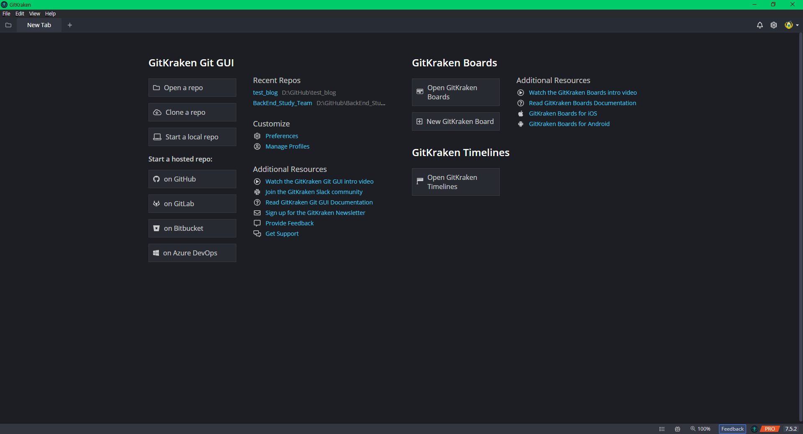

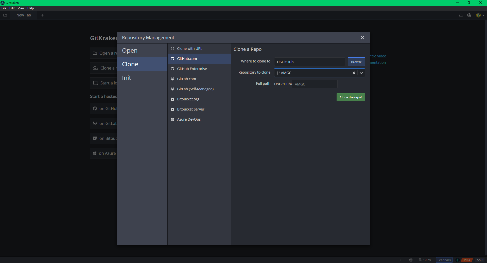

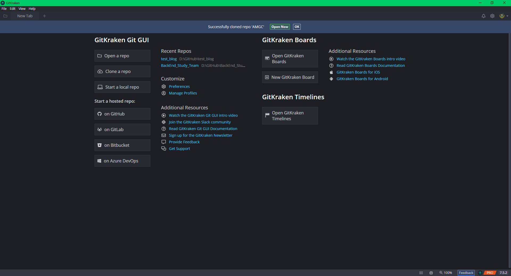


## Branch 만들기

상단의 toolbar에서 **branch** 버튼을 클릭합니다. 

"add-your-name" 이런 식으로 branch 이름을 설정해줍니다. 저는 add-uhhyunjoo 로 설정했습니다.

branch 이름을 입력하고 엔터를 눌렀을 때 좌측 하단에 **Checkout Successful** 이라고 뜨면 branch 가 성공적으로 만들어진 겁니다.

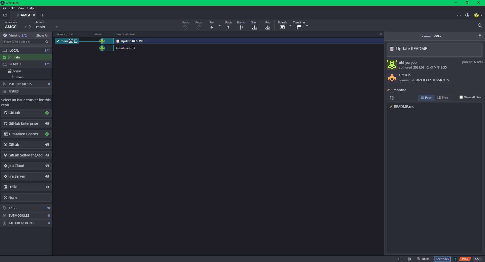


## External Editor 를 이용하여 repo 열기

#### 이 문서에서는 Visual Studio Code 를 사용했습니다.
기존에 사용하던 다른 에디터가 없다면, [Visual Studio Code 설치 링크](https://code.visualstudio.com/download)로 이동해서 설치해줍시다.

**File** → **Preferences** 로 들어가서, **External Editor** 를 <**None**> 에서 < Visual Studio Code > 로 변경합니다. 변경한 후에는 좌측 상단에 있는 Exit Preferences 를 클릭해서 나오면 됩니다.

**File** → **Open Repo in External Editor** 를 클릭하면 해당 repo가 **Visual Studio Code** 에서 열립니다. 좌측의 파일 목록에서 **README.md** 파일을 더블클릭해서 열어줍시다.

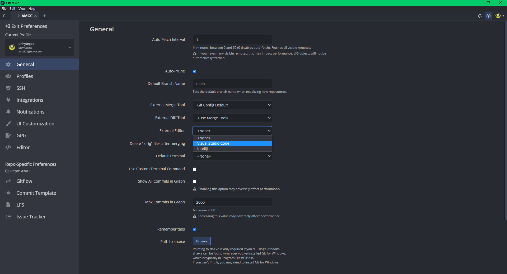

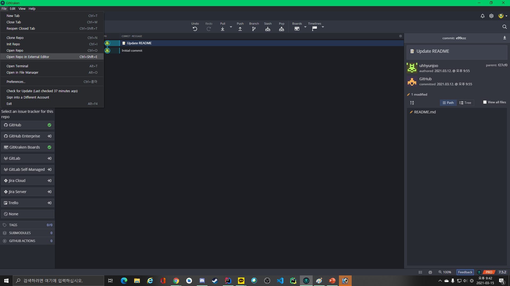

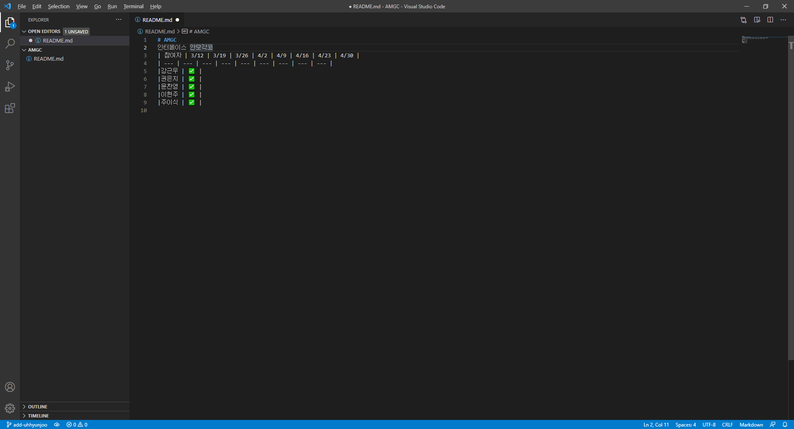

## 출석체크 하기

본인 이름과 참여 현황을 추가해줍니다. 그 주에 추가하는 사람들이 전부 같은 곳에 추가하면 conflict 가 생길 수도 있으니까, 출석순으로 추가해주세요. (원래 김인페도 세 번째 줄에 추가해야 합니다.)

만약 두 번째 주차부터 참여한다면, 아래와 같이 추가하면 됩니다.

```
|김인페| | ✅ |
```

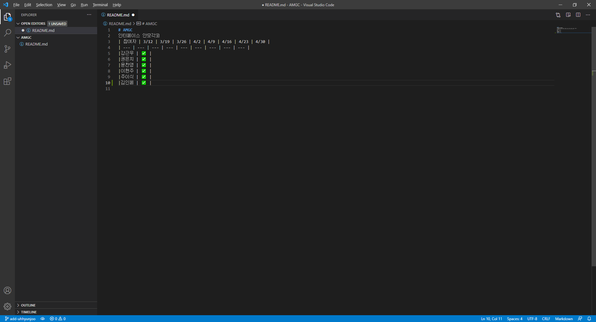

## Commit 하기
우측 상단에 **1 file change in working directory** 라는 문구가 뜹니다. **View Change** 버튼을 클릭합니다.

Commit 을 하기 전에, **Stage all changes** 를 클릭해서 **Unstaged files** 에 있는 README.md 를 **Staged Files** 로 옮겨주세요.

우측 하단에서 **Commit Message** 를 작성한 후, **Commit 1 changes to 1 file** 을 클릭합니다.
- Summary : Commit에 대해 간단하게 요약해서 적습니다.
- Description : Commit 에 대한 설명을 적습니다.

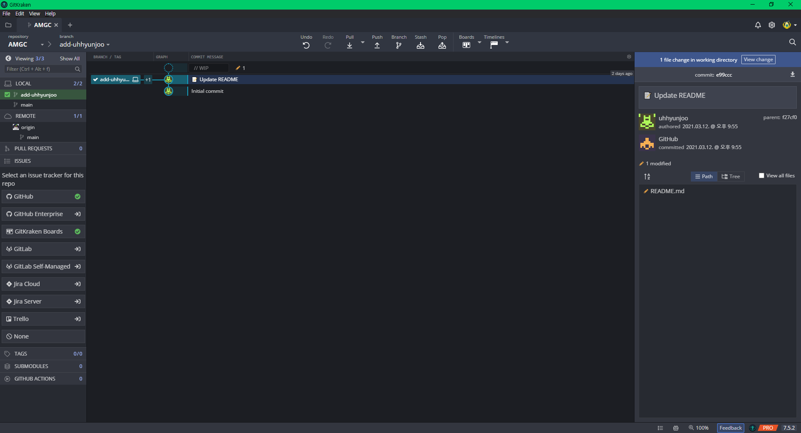

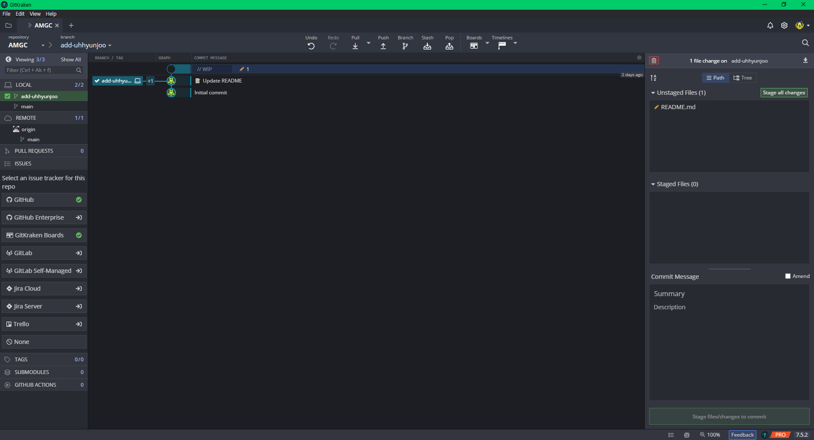

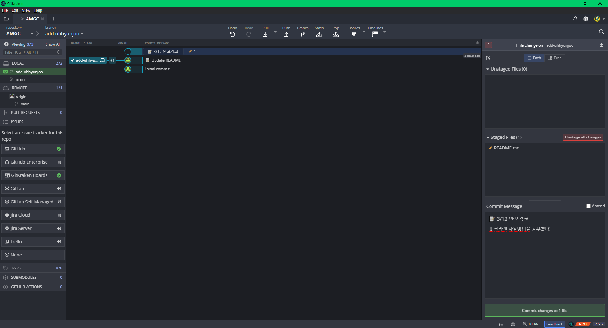

## Push 하기
상단의 toolbar에서 **push** 버튼을 클릭합니다. 

origin/add-your-name 인 걸 확인하고, **Submit** 을 클릭합니다.

좌측 하단에 origin 에 add-your-name branch 가 추가되면서 성공적으로 push 됐다는 문구가 뜹니다.


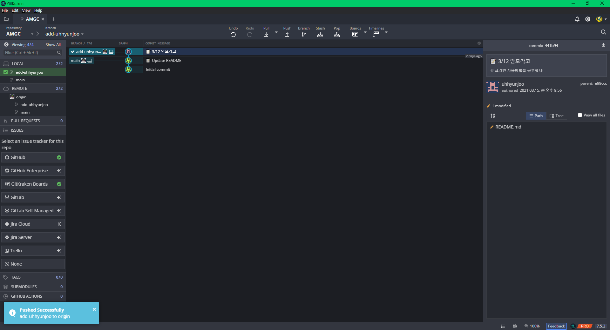

## PR 날리기
[interface-2021/AMGC](https://github.com/interface-2021/AMGC) 로 돌아가면, **'your_id:add-your-name had recent pushes less than a minute ago'** 라고 문구가 뜬 것이 보일 겁니다. **Compare & pull request** 버튼을 클릭합니다. (문구 멘트가 조금 다를 수도 있는데 상관없어요!) 

**Create pull request** 를 클릭하면, 드디어 PR이 날려집니다!
- base repository : interface-2021/AMGC, branch : main
- head repostiroy : your_id/AMGC, compare : add_your_name


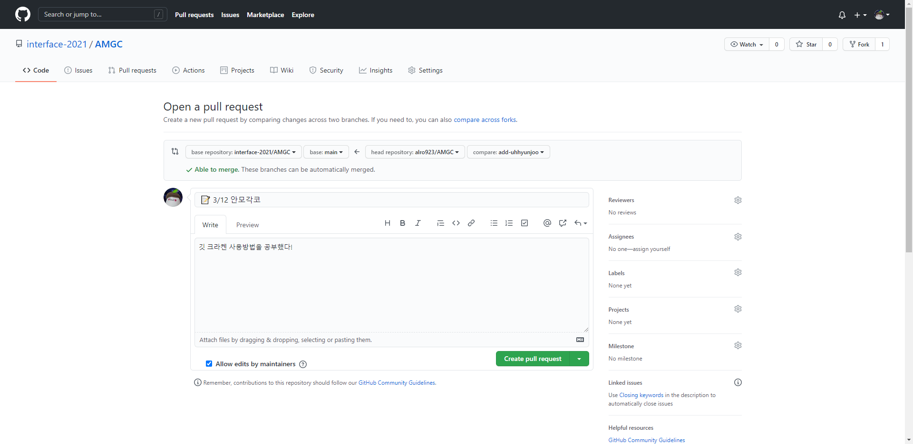

이제 organization에 contributor 권한이 있는 사람이 당신의 PR을 확인하고 merge 하면, 변경사항이 repo에 적용됩니다!

## 축하합니다! 🥳

당신은 방금 AMGC repository 를 통해 **Fork → Clone → Edit → PR** 의 workflow 를 경험했습니다. 이 과정은 "진짜" 오픈소스에 기여하는 과정과 거의 동일합니다. 매주 금요일 9시에 진행하는 안모각코 행사의 출석체크를 통해 인터페이스 부원들이 GitKraken 과 Github 에 익숙해졌으면 좋겠네요!

단순한 출석체크가 아니라, 직접 코드를 작성해서 오픈소스에 기여하는 연습을 해보고 싶다면 [sejonginterface/I_want_to_go_to_school](https://github.com/sejonginterface/I_want_to_go_to_school) repository를 추천합니다! 분명 좋은 경험이 될 거예요 😉